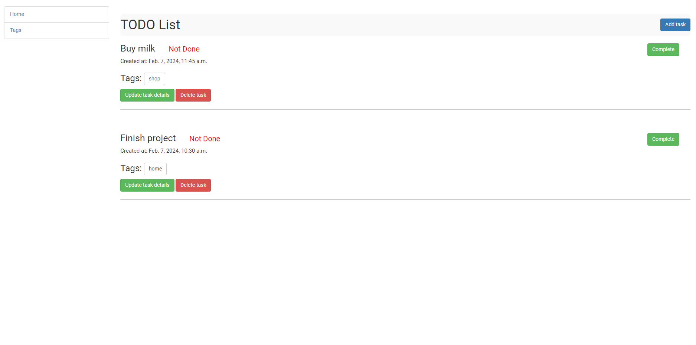
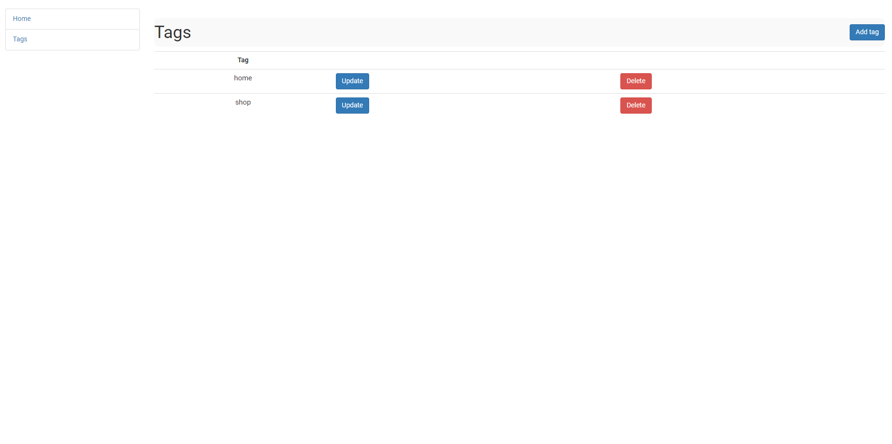

# Todo list

This project is a todo list management system designed to streamline task organization and improve productivity. It allows users to create, edit, and delete tasks, as well as manage tags to categorize their tasks effectively. The interface features intuitive buttons for easy navigation, enhancing user experience and efficiency. With this tool, users can stay organized and focused on their tasks with ease.

## Installing

Python3 must be already installed

```shell
git clone https://github.com/tiron-vadym/todo-list.git
cd todo_list
python -m venv venv
source venv/Scripts/activate
pip install -r requirements.txt
python manage.py runserver
```

## Features

* Task: Add, delete and edit tasks.

* Tag: Add, delete and edit tag.

* Interface: Add buttons for convenient navigation.


## Demo



